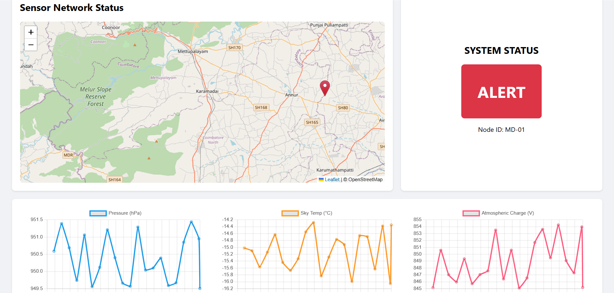

## C-WARN 
1. create a python env 
   python -m venv venv
2. Install dependencies 
   pip install flask paho-mqtt flask-cors
3. activate env 
   venv\Scripts\activate
4. python sensor_simulator.py 
5. run flask server 
   python app.py
## SCREENSHOTS

   
